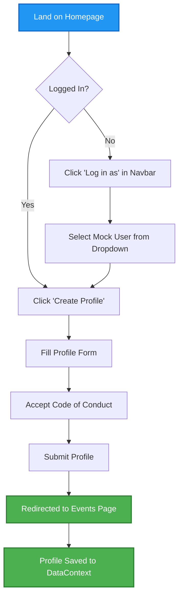
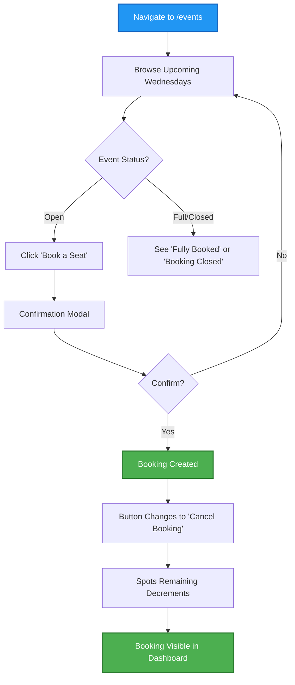
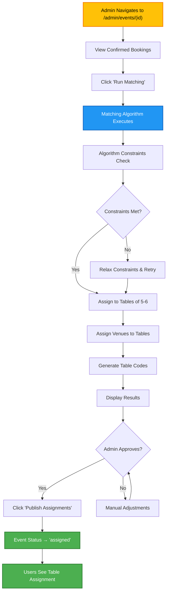
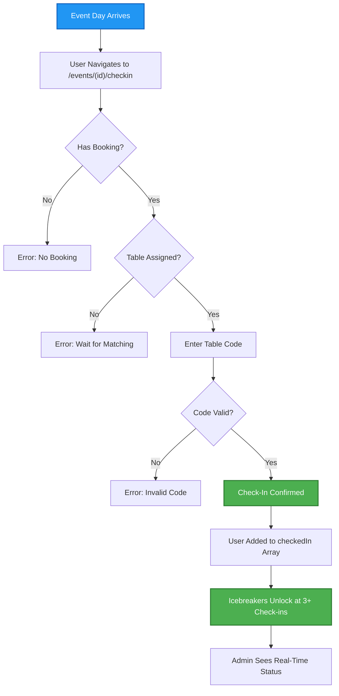
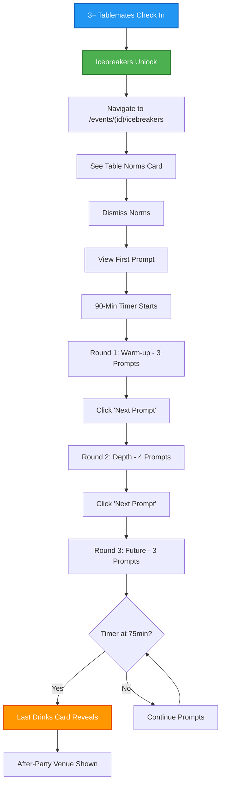
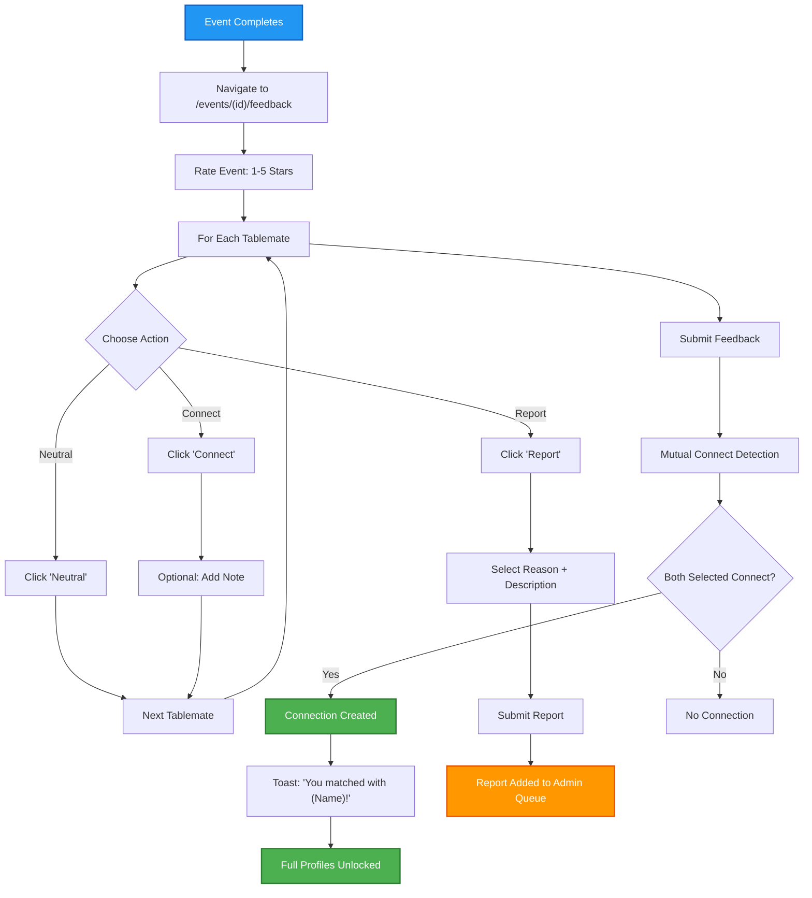
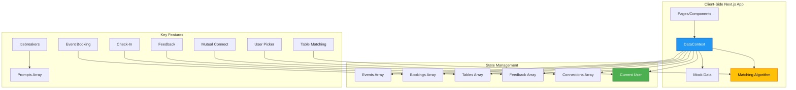
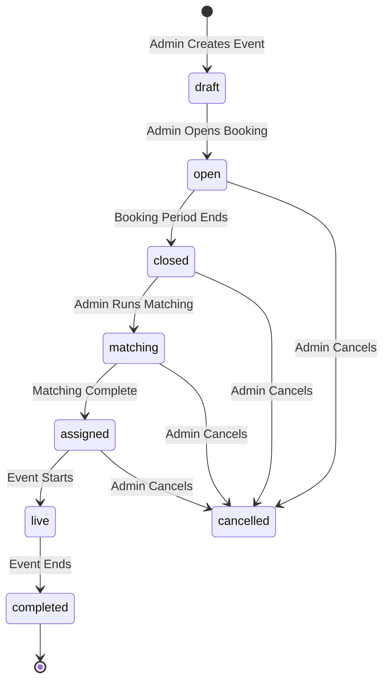
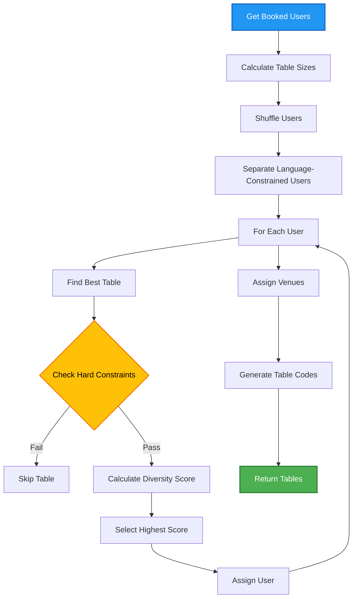
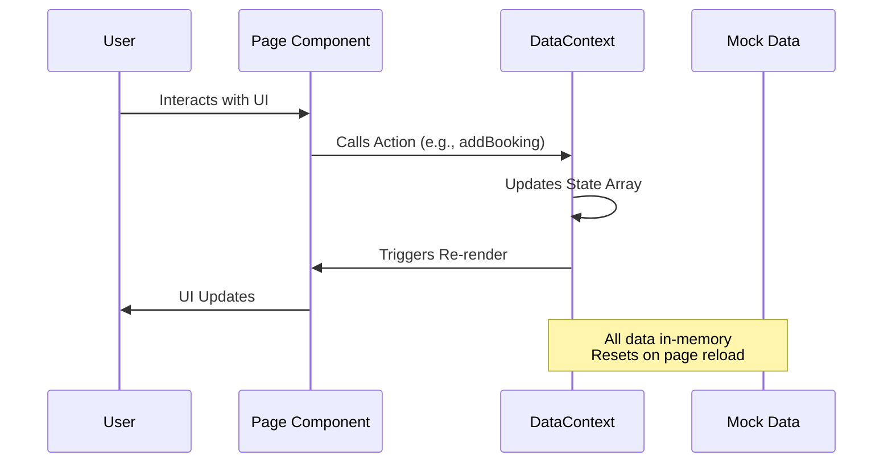

# DevTables User Guide

A concise guide to understanding how DevTables works, based on the codebase and specifications.

## Overview

**DevTables** is a recurring small-group dinner platform for developers in Medellin. Every Wednesday, 30 developers are algorithmically matched into tables of 6 at local restaurants, cafes, or coworking spaces for a 90-minute structured dinner with built-in icebreakers and conversation scaffolding.

### Key Concepts

- **Events**: Weekly Wednesday dinners (30 max attendees)
- **Bookings**: User reservations for events (free, just split the bill)
- **Tables**: Groups of 5-6 developers assigned by matching algorithm
- **Check-in**: Code-word verification at the venue
- **Icebreakers**: Structured conversation prompts during dinner
- **Connections**: Mutual opt-in networking after events
- **Matching**: Algorithm that creates diverse, compatible table groups

---

## Core User Flows

### Flow 1: Onboarding & Profile Creation

**Flow Steps:**
1. Land on Homepage
2. If not logged in → Click "Log in as" in Navbar → Select Mock User from Dropdown
3. If logged in → Click "Create Profile"
4. Fill Profile Form
5. Accept Code of Conduct (required)
6. Submit Profile
7. Redirected to Events Page
8. Profile Saved to DataContext

**Flow Diagram:**

**Profile Fields:**
- Basic: Name, title, location (city zone), bio
- Tech: Tech stack, role category, experience level
- Goals: Meet co-founders, find collaborators, learn tech, socialize, practice language
- Language preference: Spanish only / English only / Either
- Social: GitHub, LinkedIn, Discord (optional)
- **Required**: Code of Conduct acceptance

---

### Flow 2: Booking an Event

**Flow Steps:**
1. Navigate to `/events`
2. Browse Upcoming Wednesdays
3. Check Event Status:
   - **Open** → Click "Book a Seat"
   - **Full/Closed** → See "Fully Booked" or "Booking Closed"
4. Confirmation Modal appears
5. Confirm → Booking Created
6. Button changes to "Cancel Booking"
7. Spots remaining decrements
8. Booking visible in Dashboard

**Flow Diagram:**

**Event States:**
- `draft` → Not yet open
- `open` → Accepting bookings
- `closed` → Booking period ended
- `matching` → Algorithm running
- `assigned` → Tables published
- `live` → Event happening now
- `completed` → Event finished
- `cancelled` → Event cancelled

---

### Flow 3: Matching & Table Assignment

**Flow Steps:**
1. Admin navigates to `/admin/events/[id]`
2. View Confirmed Bookings
3. Click "Run Matching"
4. Matching Algorithm Executes
5. Algorithm checks constraints
6. If constraints met → Assign to Tables of 5-6
7. If constraints not met → Relax constraints & retry
8. Assign Venues to Tables
9. Generate Table Codes (e.g., "MESA-7A2F")
10. Display Results
11. Admin reviews and can make manual adjustments
12. Admin clicks "Publish Assignments"
13. Event Status changes to "assigned"
14. Users see their table assignment

**Flow Diagram:**

**Matching Constraints (Hard):**
- Table size: 5-6 people
- No repeat pairings from last 4 events
- Language compatibility (Spanish-only not with English-only majority)
- No blocked users together

**Diversity Rules (Soft - Maximized):**
- Tech stack diversity (30% weight)
- Role diversity (30% weight)
- Experience level spread (20% weight)
- Goal diversity (20% weight)

---

### Flow 4: Check-In Process

**Flow Steps:**
1. Event Day Arrives
2. User navigates to `/events/[id]/checkin`
3. System checks: Has Booking?
   - **No** → Error: "No Booking"
   - **Yes** → Continue
4. System checks: Table Assigned?
   - **No** → Error: "Wait for Matching"
   - **Yes** → Continue
5. User enters Table Code (e.g., "MESA-7A2F")
6. System validates code
   - **Invalid** → Error: "Invalid Code"
   - **Valid** → Check-In Confirmed
7. User added to `checkedIn` array
8. Icebreakers unlock when 3+ tablemates check in
9. Admin sees real-time check-in status

**Flow Diagram:**

**Check-In Requirements:**
- Must have confirmed booking
- Must have table assignment
- Must enter correct 4-character table code (e.g., "MESA-7A2F")

---

### Flow 5: During Event - Icebreakers

**Flow Steps:**
1. 3+ tablemates check in → Icebreakers unlock
2. Navigate to `/events/[id]/icebreakers`
3. See Table Norms Card (dismiss to continue)
4. View First Prompt
5. 90-minute timer starts
6. **Round 1: Warm-up** - 3 prompts (~20 min)
7. Click "Next Prompt"
8. **Round 2: Depth** - 4 prompts (~40 min)
9. Click "Next Prompt"
10. **Round 3: Future** - 3 prompts (~20 min)
11. When timer reaches 75 min → Last Drinks card reveals
12. After-party venue shown with map link

**Flow Diagram:**

**Icebreaker Structure:**
- **10 prompts total** per event
- **Round 1 (Warm-up)**: 3 prompts, ~20 min - Light, fun questions
- **Round 2 (Depth)**: 4 prompts, ~40 min - Career and learning
- **Round 3 (Future)**: 3 prompts, ~20 min - Forward-looking, collaborative

**Table Norms:**
- Phones away except for icebreaker app
- Listen as much as you speak
- What's shared stays at the table
- No recruiting pitches

---

### Flow 6: Post-Event Feedback & Connections

**Flow Steps:**
1. Event completes
2. Navigate to `/events/[id]/feedback`
3. Rate Event: 1-5 stars
4. For each tablemate, choose action:
   - **Connect** → Click "Connect" → Optional: Add note
   - **Neutral** → Click "Neutral"
   - **Report** → Click "Report" → Select reason + description → Submit report
5. Move to next tablemate (repeat for all)
6. Submit Feedback
7. System runs mutual connect detection
8. If both parties selected "Connect" → Connection created
9. Toast notification: "You matched with [Name]!"
10. Full profiles unlocked for mutual connections
11. Reports added to admin queue

**Flow Diagram:**

**Connection Privacy:**
- **Before mutual connect**: Only display name, avatar, tech stack visible
- **After mutual connect**: Full profile (name, GitHub, LinkedIn, email) visible
- Either party can delete connection anytime

---

## Architecture Overview

**Architecture Diagram:**

---

## Key Features Explained

### 1. Simulated Authentication
- **No real auth** - Uses "Log in as" dropdown in navbar
- Selects from mock users in `devTablesUsers` array
- Sets `currentUser` in DataContext
- Session persists until page reload (in-memory only)

### 2. Event Lifecycle

**State Diagram:**

### 3. Matching Algorithm Flow

**Algorithm Steps:**
1. Get Booked Users
2. Calculate Table Sizes (5-6 per table)
3. Shuffle Users (randomize order)
4. Separate Language-Constrained Users
5. For Each User:
   - Find Best Table
   - Check Hard Constraints (table size, repeat pairs, language, blocks)
   - If constraints pass → Calculate Diversity Score
   - Select table with highest score
   - Assign User to table
6. Assign Venues to Tables
7. Generate Table Codes (4-character codes)
8. Return Tables

**Algorithm Flow Diagram:**

**Algorithm Details:**
- **Input**: Booked users, venues, recent pairs (last 4 events), blocked pairs
- **Output**: Array of `DinnerTable` objects with members, venue, code
- **Complexity**: O(n × t) where n=users, t=tables (fine for 30 users)
- **Constraints**: Hard constraints must be satisfied, soft rules maximized

### 4. Data Flow

**Sequence Diagram:**

---

## Routes & Pages

| Route | Purpose | Key Features |
|-------|---------|--------------|
| `/` | Homepage | Hero, stats, next event card, quick links |
| `/events` | Event listing | Browse upcoming dinners, book seats |
| `/events/[id]` | Event detail | Full info, booking, table assignment view |
| `/events/[id]/checkin` | Check-in | Code word entry, confirmation |
| `/events/[id]/icebreakers` | During event | Prompt deck, timer, Last Drinks reveal |
| `/events/[id]/feedback` | Post-event | Rate event, connect/neutral/report tablemates |
| `/developers` | Developer directory | Browse all developers |
| `/developers/new` | Create profile | Extended form with DevTables fields |
| `/dashboard` | User dashboard | Bookings, connections, stats |
| `/connections` | My connections | Mutual connections list, delete option |
| `/admin` | Admin dashboard | Metrics, overview |
| `/admin/events/[id]` | Manage event | Run matching, view check-ins, publish |
| `/admin/reports` | Report queue | Review and action reports |
| `/code-of-conduct` | CoC page | Static rules page |

---

## State Management

All state is managed via **React Context** (`DataContext.tsx`) with in-memory arrays:

- `devTablesUsers[]` - All registered users
- `currentUser` - Currently logged-in user (null if none)
- `events[]` - All dinner events
- `bookings[]` - User reservations
- `tables[]` - Table assignments (created by matching)
- `feedback[]` - Post-event ratings and votes
- `connections[]` - Mutual connections
- `reports[]` - User reports
- `blocks[]` - User blocks
- `prompts[]` - Icebreaker prompt pool

**Important**: All data is **ephemeral** - resets on page reload. No persistence in MVP.

---

## Admin Functions

### Event Management
1. Create events (date, city zone, venues, capacity)
2. Open/close booking periods
3. Run matching algorithm
4. Publish table assignments
5. View real-time check-ins
6. Complete events

### Trust & Safety
1. Review reports queue
2. Take action (warn, suspend, ban)
3. View metrics (attendance, connections, NPS)

### Metrics Dashboard
- Total users
- Events run
- Average attendance rate
- Average connection rate
- Average event rating
- Total reports

---

## Privacy & Safety

### Privacy Boundaries
- **Pre-connect**: Display name (first name only), avatar, tech stack visible
- **Post-connect**: Full profile (name, GitHub, LinkedIn, email) visible
- **Feedback**: Individual ratings never revealed to rated person
- **Mutual connects**: Only created when both parties opt in

### Safety Features
- **Blocking**: Instant, prevents future co-tabling
- **Reporting**: Submit with reason, admin reviews
- **Code of Conduct**: Must accept to create profile
- **Admin actions**: Warn, suspend, ban users

---

## Technical Stack

- **Framework**: Next.js 16 (App Router)
- **UI**: React 19
- **Styling**: Tailwind CSS 4
- **State**: React Context + useState
- **Data**: In-memory mock arrays (no database)
- **Matching**: Pure TypeScript function (client-side)
- **Auth**: Simulated "Log in as" dropdown (no real auth)

---

## Quick Start for Users

1. **Log in**: Click "Log in as" in navbar, select a user
2. **Create profile**: Go to `/developers/new` (if not already created)
3. **Browse events**: Go to `/events`
4. **Book a seat**: Click "Book a Seat" on an open event
5. **Wait for matching**: Admin runs matching, you'll see table assignment
6. **Check in**: On event day, go to `/events/[id]/checkin`, enter your table code
7. **Use icebreakers**: Go to `/events/[id]/icebreakers`, follow prompts
8. **Give feedback**: After event, go to `/events/[id]/feedback`, rate and connect
9. **View connections**: Go to `/connections` to see mutual matches

---

## Notes

- **MVP Status**: This is a demo MVP with mock data
- **No Persistence**: All data resets on page reload
- **No Real Auth**: Uses simulated user switching
- **Client-Side Only**: No backend, no database, no API calls
- **Production Ready**: Would need real auth, database, and persistence for v1.1
